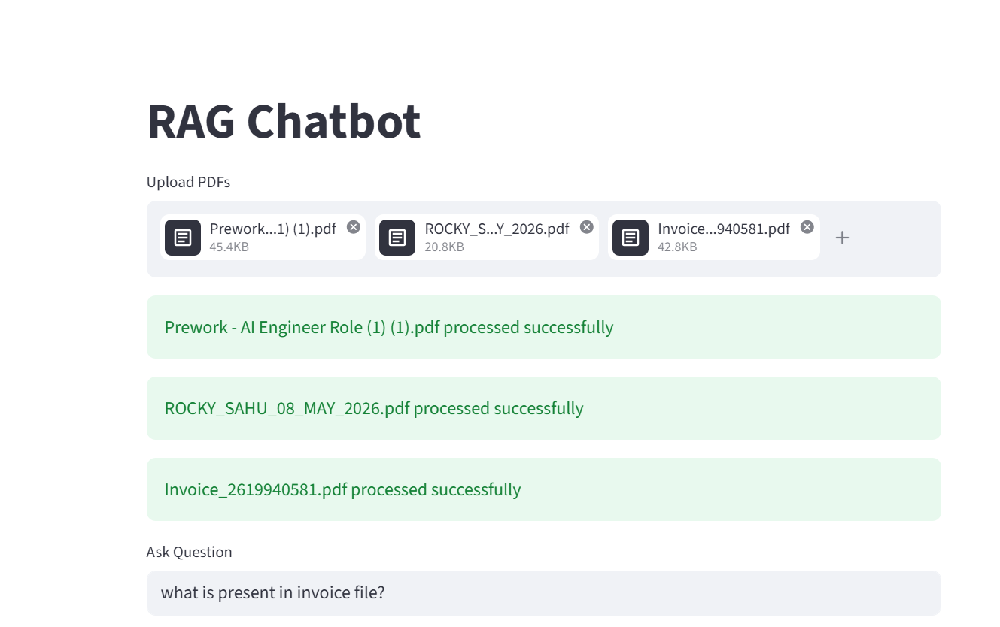

# RAG Chatbot

An AI-powered Retrieval-Augmented Generation (RAG) chatbot built using FastAPI, Streamlit, FAISS, Sentence Transformers, and Ollama.

This project allows users to upload multiple PDF documents and ask questions based on the uploaded content. The chatbot retrieves relevant chunks from the vector database and generates contextual answers using a local LLM.

---

# Features

- Upload multiple PDFs
- Extract text from PDFs
- Chunk large documents
- Generate embeddings using open-source models
- Store embeddings in FAISS vector database
- Semantic search using vector similarity
- AI-generated answers using Ollama + TinyLlama
- Source citations with page numbers
- Retrieved chunk visualization
- Fully local setup (No paid APIs)

---

# Tech Stack

## Backend
- Python
- FastAPI
- FAISS
- Sentence Transformers
- Ollama
- TinyLlama

## Frontend
- Streamlit

## Embedding Model
- BAAI/bge-small-en-v1.5

## Vector Database
- FAISS

---

# Project Structure

```bash
rag-chatbot/
│
├── backend/
│   ├── app.py
│   ├── ingestion.py
│   ├── embedding.py
│   ├── retrieval.py
│   ├── vector_store.py
│   ├── llm.py
│
├── frontend/
│   ├── streamlit_app.py
│
├── data/
│   └── pdfs/
│
├── vector_db/
│   ├── faiss.index
│   ├── chunks.pkl
│
├── requirements.txt
│
└── README.md

## Generated Answer


## Retrieved Chunks.
